# CarboPratos - Food Calorie Analyzer 🍽️

A simple and efficient system for analyzing calories in food plates using YOLO and AI.

## 🚀 How to Use

### 1. Installation

```bash
pip install -r requirements.txt
```

### 2. Execution

```bash
python main.py "path/to/your/images/folder"
```

Or run without parameters to enter the path interactively:

```bash
python main.py
```

### 3. Results

The program will:
- Process all JPEG/PNG images in the folder
- Detect foods using YOLO
- Calculate calories based on detected foods
- Generate `.txt` files with results

## 📁 Project Structure

```
CarboPratos/
├── src/
│   ├── calorie_database.py    # Calorie database
│   ├── food_detector.py       # YOLO food detector
│   ├── calorie_calculator.py  # Calorie calculator
│   └── image_processor.py     # Image processor
├── main.py                    # Main program
├── requirements.txt           # Dependencies
└── README.md                  # This file
```

## 🍎 Supported Foods

The system recognizes and calculates calories for:
- Fruits (apple, banana, grapes, etc.)
- Vegetables (carrot, broccoli, tomato, etc.)
- Proteins (chicken, beef, fish, etc.)
- Carbohydrates (bread, rice, pasta, etc.)
- Dairy (cheese, milk)

## ⚡ Features

- **Simple**: Easy-to-use command line interface
- **Efficient**: Optimized processing without unnecessary logs
- **Extensible**: Easy addition of new foods to the database
- **Robust**: Error handling and validations

## 🔧 Development

The project follows these principles:
- **SOLID**: Separation of responsibilities
- **KISS**: Simplicity and clarity
- **Performance**: Optimized for speed

## 🔄 Execution Flow

> **💡 Tip**: To view this flowchart, install a Mermaid extension in your editor:
> - **VS Code**: Install "Mermaid Preview" or "Markdown Preview Mermaid Support"
> - **Cursor**: Install "Mermaid Preview" extension
> - **Online**: Copy the mermaid code to [mermaid.live](https://mermaid.live)

```mermaid
flowchart TD
    A["🚀 Start: python main.py<br/>📁 main.py::main()"] --> B{Path provided?}
    B -->|No| C["📝 Get path from user input<br/>📁 main.py::GetFolderPath()"]
    B -->|Yes| D["📂 Use provided path<br/>📁 main.py::GetFolderPath()"]
    C --> E["✅ Validate directory path<br/>📁 main.py::ValidatePath()"]
    D --> E
    E -->|Invalid| F["❌ Show error and exit<br/>📁 main.py::ValidatePath()"]
    E -->|Valid| G["🔧 Initialize system components<br/>📁 main.py::main()"]
    
    G --> H["🤖 Create FoodDetector<br/>📁 food_detector.py::__init__()"]
    H --> I["🧮 Create CalorieCalculator<br/>📁 calorie_calculator.py::__init__()"]
    I --> J["🖼️ Create ImageProcessor<br/>📁 image_processor.py::__init__()"]
    J --> K["📂 Process directory<br/>📁 main.py::ProcessDirectory()"]
    
    K --> L["🔍 Find all image files<br/>📁 image_processor.py::FindImageFiles()<br/>.jpg, .jpeg, .png, .bmp, .tiff, .avif, .webp"]
    L --> M["🔄 For each image file<br/>📁 image_processor.py::ProcessDirectory()"]
    
    M --> N["📷 Load image with OpenCV/PIL<br/>📁 calorie_calculator.py::_LoadImage()"]
    N --> O["🎯 Run YOLO detection<br/>📁 food_detector.py::RunYOLODetection()"]
    O --> P["📊 Create detection visualization<br/>📁 food_detector.py::VisualizeDetections()"]
    P --> Q["⚙️ Process YOLO results<br/>📁 food_detector.py::_ProcessDetectionResults()"]
    Q --> R{Foods detected?}
    
    R -->|No| S["📭 Return empty result<br/>📁 food_detector.py::_ProcessDetectionResults()"]
    R -->|Yes| T["🔄 For each detection<br/>📁 calorie_calculator.py::ProcessFoodDetections()"]
    T --> U["📐 Calculate food area in cm²<br/>📁 food_detector.py::CalculateFoodArea()"]
    U --> V["⚖️ Get food density<br/>📁 food_detector.py::GetFoodDensity()"]
    V --> W["📏 Estimate food height<br/>📁 food_detector.py::EstimateFoodHeight()"]
    W --> X["🧮 Calculate volume and weight<br/>📁 food_detector.py::CalculateFoodWeight()"]
    X --> Y["⚖️ Apply weight limitations 30g-400g<br/>📁 food_detector.py::ApplyWeightLimitations()"]
    Y --> Z["🔥 Calculate calories per food<br/>📁 calorie_calculator.py::CalculateFoodCalories()"]
    Z --> AA["📊 Sum total calories<br/>📁 calorie_calculator.py::CalculateTotalCalories()"]
    
    AA --> BB["💾 Save result to .txt file<br/>📁 image_processor.py::_SaveResultToFile()"]
    BB --> CC{More images?}
    CC -->|Yes| M
    CC -->|No| DD["📋 Display processing summary<br/>📁 main.py::PrintResume()"]
    
    S --> BB
    
    DD --> EE["📊 Show total images processed<br/>📁 main.py::PrintResume()"]
    EE --> FF["✅ Show successes and errors<br/>📁 main.py::PrintResume()"]
    FF --> GG["🔥 Show total calories detected<br/>📁 main.py::PrintResume()"]
    GG --> HH["🏁 End"]
    
    style A fill:#e1f5fe
    style HH fill:#c8e6c9
    style F fill:#ffcdd2
    style S fill:#fff3e0
```



## 📝 Output Example

For an image `rice_plate.jpg`, it will generate `rice_plate_calories.txt`:

```
CALORIE ANALYSIS - rice_plate.jpg
==================================================

Total calories: 350.5 kcal
Foods detected: 2

Food details:
------------------------------
• Rice: 150.0g (195.0 kcal) [Confidence: 0.85]
• Chicken: 120.0g (198.0 kcal) [Confidence: 0.92]
```
