# CarboPratos - Food Calorie Analyzer 🍽️

A simple and efficient system for analyzing calories in food plates using YOLO and AI.

## 🚀 How to Use

### 1. Installation

```bash
pip install -r requirements.txt
```

### 2. Execution

```bash
python main.py "path/to/your/images/folder"
```

Or run without parameters to enter the path interactively:

```bash
python main.py
```

### 3. Results

The program will:
- Process all JPEG/PNG images in the folder
- Detect foods using YOLO
- Calculate calories based on detected foods
- Generate `.txt` files with results

## 📁 Project Structure

```
CarboPratos/
├── src/
│   ├── calorie_database.py    # Calorie database
│   ├── food_detector.py       # YOLO food detector
│   ├── calorie_calculator.py  # Calorie calculator
│   └── image_processor.py     # Image processor
├── main.py                    # Main program
├── requirements.txt           # Dependencies
└── README.md                  # This file
```

## 🍎 Supported Foods

The system recognizes and calculates calories for:
- Fruits (apple, banana, grapes, etc.)
- Vegetables (carrot, broccoli, tomato, etc.)
- Proteins (chicken, beef, fish, etc.)
- Carbohydrates (bread, rice, pasta, etc.)
- Dairy (cheese, milk)

## ⚡ Features

- **Simple**: Easy-to-use command line interface
- **Efficient**: Optimized processing without unnecessary logs
- **Extensible**: Easy addition of new foods to the database
- **Robust**: Error handling and validations

## 🔧 Development

The project follows these principles:
- **SOLID**: Separation of responsibilities
- **KISS**: Simplicity and clarity
- **Performance**: Optimized for speed

## 🔄 Execution Flow

> **💡 Tip**: To view this flowchart, install a Mermaid extension in your editor:
> - **VS Code**: Install "Mermaid Preview" or "Markdown Preview Mermaid Support"
> - **Cursor**: Install "Mermaid Preview" extension
> - **Online**: Copy the mermaid code to [mermaid.live](https://mermaid.live)

```mermaid
flowchart TD
    A[Start: python main.py] --> B{Path provided?}
    B -->|No| C[Get path from user input]
    B -->|Yes| D[Use provided path]
    C --> E[Validate directory path]
    D --> E
    E -->|Invalid| F[Show error and exit]
    E -->|Valid| G[Initialize system components]
    
    G --> H[Create FoodDetector]
    H --> I[Create CalorieCalculator with detector]
    I --> J[Create ImageProcessor with calculator]
    J --> K[Process directory]
    
    K --> L[Find all image files<br/>.jpg, .jpeg, .png, .bmp, .tiff, .avif, .webp]
    L --> M[For each image file]
    
    M --> N[Load image with OpenCV/PIL]
    N --> O[Run YOLO detection]
    O --> P{Foods detected?}
    
    P -->|No| Q[Try filename detection]
    P -->|Yes| R[Process YOLO results]
    Q --> S{Found foods in filename?}
    S -->|No| T[Return empty result]
    S -->|Yes| U[Create detections from filename]
    
    R --> V[For each detection]
    U --> V
    V --> W[Calculate food area in cm²]
    W --> X[Get food density]
    X --> Y[Estimate food height]
    Y --> Z[Calculate volume and weight]
    Z --> AA[Apply weight limitations 30g-400g]
    AA --> BB[Calculate calories per food]
    BB --> CC[Sum total calories]
    
    CC --> DD[Save result to .txt file]
    DD --> EE{More images?}
    EE -->|Yes| M
    EE -->|No| FF[Display processing summary]
    
    T --> DD
    
    FF --> GG[Show total images processed]
    GG --> HH[Show successes and errors]
    HH --> II[Show total calories detected]
    II --> JJ[End]
    
    style A fill:#e1f5fe
    style JJ fill:#c8e6c9
    style F fill:#ffcdd2
    style T fill:#fff3e0
```



## 📝 Output Example

For an image `rice_plate.jpg`, it will generate `rice_plate_calories.txt`:

```
CALORIE ANALYSIS - rice_plate.jpg
==================================================

Total calories: 350.5 kcal
Foods detected: 2

Food details:
------------------------------
• Rice: 150.0g (195.0 kcal) [Confidence: 0.85]
• Chicken: 120.0g (198.0 kcal) [Confidence: 0.92]
```
